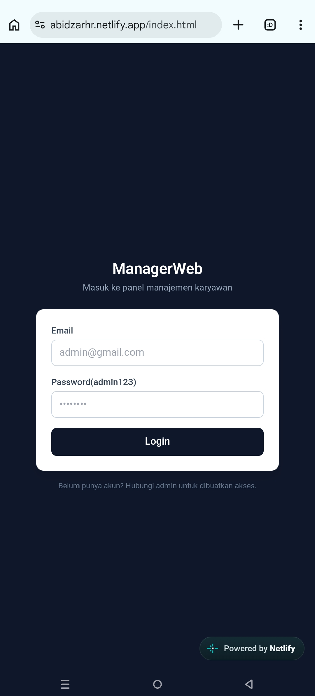
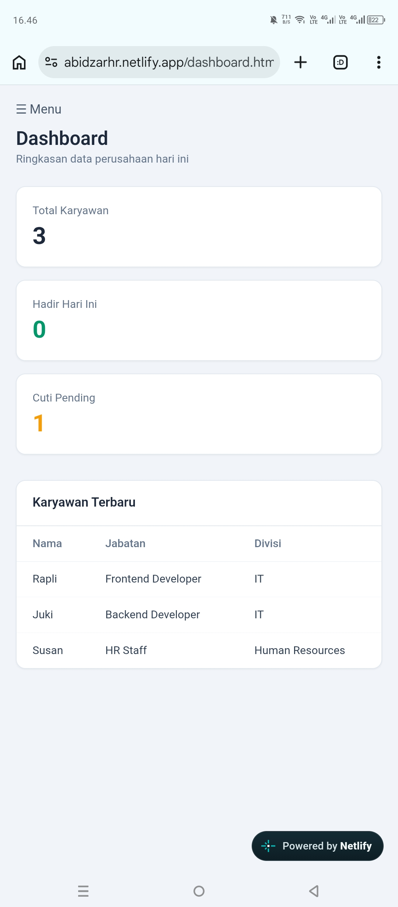
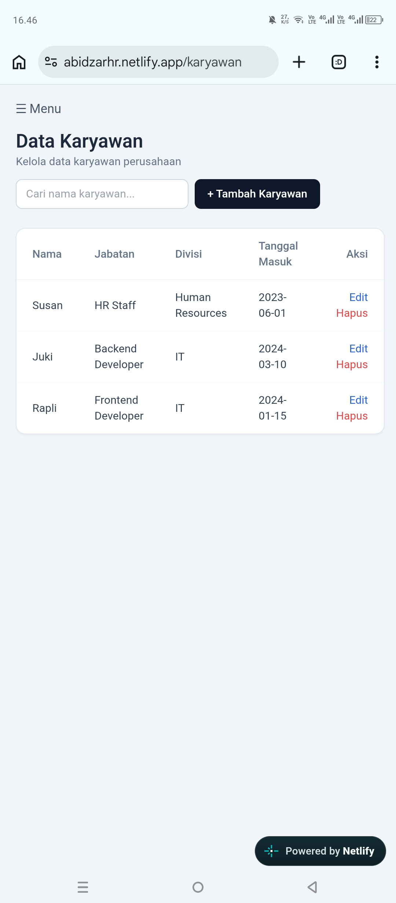
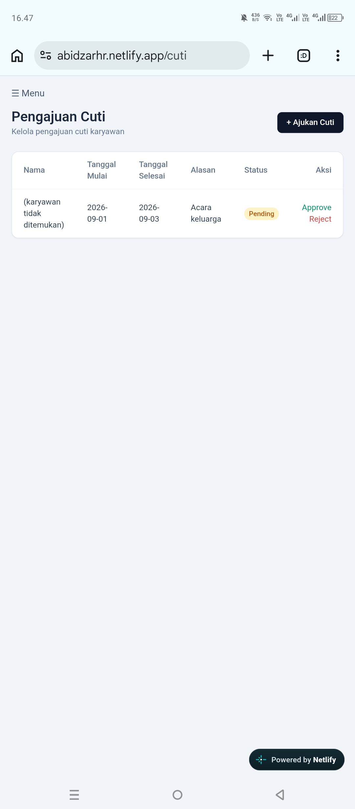

Employee Management System

A full-stack employee management system for managing employee data, leave requests, attendance records, and dashboard information through a web-based interface.

🚀 Live Demo

Frontend:
https://abidzarhr.netlify.app

Production API:
https://managerbyabidzar-production.up.railway.app/api

---

✨ Features

- 🔐 Firebase Authentication
- 👨‍💼 Employee Management
  - Create employee
  - View employee data
  - Update employee
  - Delete employee
- 🏖️ Leave Management
  - View leave requests
  - Create leave requests
  - Update leave requests
- 🕒 Attendance Management
  - View attendance records
  - Add attendance records
- 📊 Dashboard
- 📱 Responsive user interface
- 🔗 REST API integration
- 🌐 Production deployment

---

🛠️ Tech Stack

Frontend

- HTML5
- CSS3
- JavaScript
- Tailwind CSS
- Fetch API

Backend

- Node.js
- Express.js
- REST API

Authentication

- Firebase Authentication

Development & Tools

- npm
- Git
- GitHub
- Postman
- Railway
- Netlify

---
## 🏗️ Architecture

```text
┌─────────────────────────┐
│        Frontend         │
│   HTML + JS + Tailwind  │
└────────────┬────────────┘
             │
             │ Fetch API
             ▼
┌─────────────────────────┐
│      Express.js API     │
│         Node.js         │
└────────────┬────────────┘
             │
      ┌──────┼──────┐
      ▼      ▼      ▼
 Karyawan   Cuti   Absensi
  Routes   Routes   Routes
```

Authentication is handled separately through **Firebase Authentication**.

---

## 📁 Project Structure

```text
manage-employees-main/
│
├── backend/
│   ├── routes/
│   │   ├── absensi.js
│   │   ├── cuti.js
│   │   └── karyawan.js
│   │
│   ├── package.json
│   ├── seed.js
│   └── server.js
│
└── frontend/
    ├── css/
    │   ├── style.css
    │   └── output.css
    │
    ├── js/
    │   ├── api-config.js
    │   ├── absensi.js
    │   ├── auth.js
    │   ├── cuti.js
    │   ├── dashboard.js
    │   ├── firebase-config.js
    │   └── karyawan.js
    │
    ├── absensi.html
    ├── cuti.html
    ├── dashboard.html
    ├── index.html
    ├── karyawan.html
    ├── package.json
    └── tailwind.config.js
```
---

🔌 REST API

Employee

Method| Endpoint| Description
GET| "/api/karyawan"| Get all employees
POST| "/api/karyawan"| Create employee
PUT| "/api/karyawan/:id"| Update employee
DELETE| "/api/karyawan/:id"| Delete employee

Leave

Method| Endpoint| Description
GET| "/api/cuti"| Get leave data
POST| "/api/cuti"| Create leave request
PUT| "/api/cuti/:id"| Update leave request

Attendance

Method| Endpoint| Description
GET| "/api/absensi"| Get attendance data
POST| "/api/absensi"| Create attendance record

---

⚙️ Local Development

1. Clone Repository

git clone <your-repository-url>
cd manage-employees-main

2. Backend Setup

cd backend
npm install

If seed data is required:

node seed.js

Start the backend:

npm start

The backend will run at:

http://localhost:5000

3. Frontend Setup

Open a new terminal:

cd frontend
npm install

Build Tailwind CSS:

npm run build:css

Then run the frontend using a local development server such as VS Code Live Server.

---

🔐 Authentication & Security

This project uses Firebase Authentication for user authentication.

Sensitive configuration and credentials should not be committed to the repository.

For production environments, environment variables and secure configuration should be used for sensitive values.

«This repository should only contain public configuration and dummy/demo data. Never commit passwords, private keys, API secrets, or other sensitive credentials.»

---


## 🖥️ Screenshots

### Login


### Dashboard


### Employee Management


### Leave Management


---

📌 Future Improvements

- Role-based access control
- Better API validation
- Improved error handling
- Advanced employee filtering and search
- Pagination
- Improved dashboard analytics
- Improved production security
- Automated testing
- CI/CD pipeline

---

📚 What I Learned

Through this project, I practiced:

- Building REST APIs with Express.js
- Connecting frontend applications to backend APIs
- CRUD operations
- Authentication with Firebase
- API testing with Postman
- Structuring a frontend and backend application
- Using Git and GitHub for version control
- Deploying frontend and backend applications
- Working with production API environments

---

👨‍💻 Author

Abidzar Al-Ghifari

Junior Software Engineer / Full-Stack Web Developer

- GitHub: https://github.com/dzerrr-tech
- LinkedIn: https://www.linkedin.com/in/abidzar-al-ghifari/
- Portfolio: https://abidzaralghifari.netlify.app
